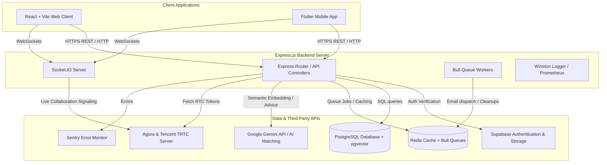
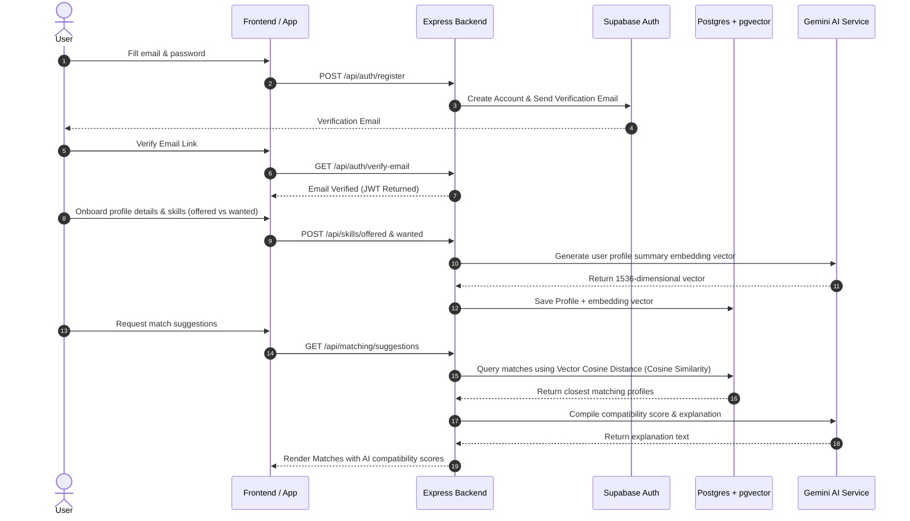
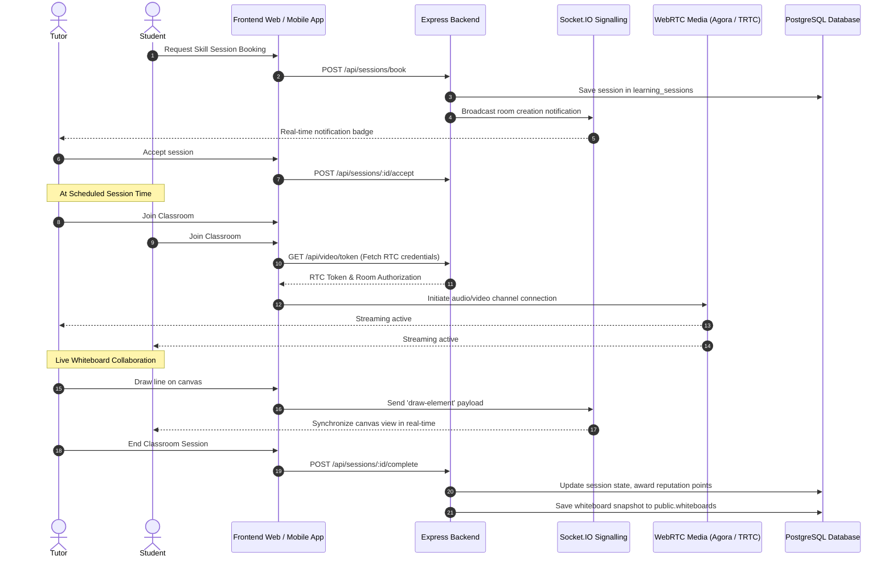

# SkillSwap // ChidhiyaGHAR

[](https://skillswap-chidiyaghar.onrender.com)
[](./frontend)
[](./app)
[](./backend/db.sql)
[](./backend/src/websocket)

Welcome to the **SkillSwap (ChidhiyaGHAR)** project repository. This is a production-ready, peer-to-peer skill exchange platform designed to match users wanting to learn a skill with mentors/peers offering that skill. The platform boasts an interactive 3D robot mascot, a responsive cybernetic HUD dashboard, real-time whiteboards, audio/video peer communication, and advanced AI matching.

---

## 🌐 Deployed Backend Information
*   **Production API URL:** `https://skillswap-chidiyaghar.onrender.com/api`
*   **WebSocket Signalling URL:** `https://skillswap-chidiyaghar.onrender.com`
*   **Health Check Endpoint:** `https://skillswap-chidiyaghar.onrender.com/health`
*   **API Metrics:** `https://skillswap-chidiyaghar.onrender.com/metrics`
*   **OpenAPI Documentation:** Located under [backend/docs/openapi.yaml](file:///d:/Rudraksh/College/app/-SkillSwap_ChidhiyaGHAR/backend/docs/openapi.yaml)

---

## 🏗️ System Architecture

The following diagram illustrates how the frontend React client, Flutter mobile app, Express backend, and the ecosystem of micro-integrations (Supabase PostgreSQL, Redis queues, Gemini AI, Sentry, and Agora/TRTC WebRTC) interact:



---

## 📁 Repository Structure

The project is structured as a monorepo organizing the frontend client, Node.js backend, and Flutter mobile application:

```
-SkillSwap_ChidhiyaGHAR/
├── frontend/                 # React Web App (Vite, TypeScript, Tailwind/Vanilla CSS)
│   ├── src/
│   │   ├── components/       # UI Components (RobotCanvas, LandingPage, WhiteboardRoom, Dashboard)
│   │   ├── services/         # API client & configurations
│   │   └── App.tsx           # Navigation, core views router, and state manager
│   └── package.json
│
├── backend/                  # Node.js + Express Production API Server
│   ├── src/
│   │   ├── ai/               # AI matching, recommendation service, and Gemini fallback
│   │   ├── config/           # Database, Supabase, Redis, and environmental configuration
│   │   ├── controllers/      # Route controllers (Auth, Skills, Matches, Sessions, etc.)
│   │   ├── middleware/       # JWT Auth, validation schemas, RBAC, and error handlers
│   │   ├── routes/           # API Endpoint Routers (Admin, Chat, Badges, Whiteboard, Video, etc.)
│   │   ├── services/         # Background services (Nodemailer, Rate limiters, DB client)
│   │   ├── websocket/        # Socket.IO Event Handlers (Real-time whiteboard, calls, alerts)
│   │   └── workers/          # Bull Queue background processors for email & automation
│   ├── db.sql                # Production PostgreSQL schema (including pgvector configurations)
│   ├── vercel.json           # Serverless deployment configuration mappings
│   └── package.json
│
└── app/                      # Cross-Platform Flutter Mobile Client
    ├── lib/                  # Dart source files
    │   ├── config/           # Environment configs, API endpoints (app_config.dart)
    │   └── main.dart         # Flutter application entrypoint
    └── pubspec.yaml          # Flutter dependency configuration
```

---

## ⚡ Core Features

1.  **3D Interactive Mascot**
    *   Powered by Three.js & React Three Fiber (`RobotCanvas.tsx`).
    *   Stateful visor changing moods ('eyes', 'quote', 'swap', 'success', 'camera') to provide visual feedback to user activities.
2.  **AI-Powered Peer Matching (`matching.route.js`)**
    *   Utilizes high-dimensional vector embeddings generated using Google Gemini/OpenAI API.
    *   Stores vector representations in PostgreSQL utilizing the `pgvector` extension.
    *   Calculates similarity using Cosine Distance metric with an `ivfflat` index configuration for rapid database queries.
3.  **Collaborative Whiteboard (`WhiteboardRoom.tsx`)**
    *   Synchronous canvas collaboration utilizing Socket.IO server signals.
    *   Interactive tools: Freehand brush, rectangle, circle, colors, line thickness, and clear canvas.
    *   Canvas states are stored persistently in the database (`public.whiteboards`) as serialized JSON schemas.
4.  **Integrated Voice & Video Calls (`video.route.js`)**
    *   Secured communication utilizing Agora RTC tokens and Tencent RTC (TRTC).
    *   Generates runtime tokens securely through verified backend endpoints.
5.  **AI RAG (Retrieval-Augmented Generation) on Session Notes**
    *   Session summaries and notes are chunked, vectorized, and stored inside the database under `session_note_vectors`.
    *   Allows semantic vector search to trace back topics, notes, or tips from past exchanges.
6.  **Gamified Leaderboard & Badges (`badges.route.js`)**
    *   Track community contribution via Reputation points.
    *   Tiered Badges system: Bronze, Silver, Gold, Platinum, and Diamond levels based on user stats.
7.  **Production Security Suite**
    *   Helmet.js headers, strict CORS, express-rate-limit, CSURF validation, and bcrypt password hashing.
    *   Multi-Factor Authentication (MFA) supported using Speakeasy (TOTP code generators).

---

## 🔄 Core Workflows

### 1. User Registration, Profile Building & Matching



---

### 2. Session Booking & Collaborative Live Classroom



---

## 💾 Database Schema Reference

The core tables used to power the database logic under [backend/db.sql](file:///d:/Rudraksh/College/app/-SkillSwap_ChidhiyaGHAR/backend/db.sql) include:

| Table | Purpose | Highlight Column |
| :--- | :--- | :--- |
| **`users`** | Core login, security settings, role-based access control, and MFA states. | `mfa_secret`, `role` |
| **`profiles`** | Persona details, location, experience levels, ratings, and embedding vectors. | `embedding vector(1536)` |
| **`skills`** | Verified catalog of categories and tags available to learn or teach. | `category_id`, `slug` |
| **`user_skills_offered`** | Map of what users are teaching, their proficiency, and years of experience. | `embedding vector(1536)` |
| **`user_skills_wanted`** | Map of what users want to learn, urgency, and targeted levels. | `urgency` |
| **`matches`** | State machine for matchmaking (pending, accepted, AI explanation, match scores). | `match_score`, `ai_explanation` |
| **`learning_sessions`** | Scheduled and current peer classes, attendance states, and channel indicators. | `agora_channel`, `status` |
| **`reviews`** | Ratings and feedback collected after completing sessions. | `rating` (1-5) |
| **`reputation_points`** | Point transaction ledger tracking community contributions. | `points` |
| **`badge_definitions`** | Static definitions for gamification categories (bronze -> diamond). | `criteria` |
| **`whiteboards`** | Persistent Canvas elements for drawing logs. | `elements` (jsonb) |
| **`session_note_vectors`** | Vector pieces of session notes for RAG semantic search integrations. | `embedding vector(1536)` |

---

## 🛠️ Installation & Local Setup

### 📋 Prerequisites
*   Node.js (v20+ recommended)
*   Flutter SDK (v3.0+ configured for mobile)
*   Redis server (v6.0+ local instance or cloud cache)
*   PostgreSQL database (configured with the `pgvector` extension)

---

### 1. Backend Server Setup
1.  Navigate into the backend directory:
    ```bash
    cd backend
    ```
2.  Install required dependencies:
    ```bash
    npm install
    ```
3.  Configure environment values:
    Create a `.env` file copying the keys from `.env.example`:
    ```bash
    cp .env.example .env
    ```
    Configure the PostgreSQL database connection string, Supabase API credentials, Redis endpoint, and Gemini token.
4.  Run database migrations to initialize tables, index profiles, and create RPC procedures:
    ```bash
    npm run db:migrate
    ```
5.  Start the local Development server:
    ```bash
    npm run dev
    ```
6.  Start Bull Queue Workers in a separate window to process background mail notifications:
    ```bash
    npm run dev:workers
    ```

---

### 2. Frontend Web Application Setup
1.  Navigate into the frontend directory:
    ```bash
    cd frontend
    ```
2.  Install dependencies:
    ```bash
    npm install
    ```
3.  Ensure environment variables point to the running backend server.
4.  Run the Vite development engine:
    ```bash
    npm run dev
    ```
5.  Open [http://localhost:5173](http://localhost:5173) in your browser.

---

### 3. Flutter Mobile Application Setup
1.  Navigate to the app folder:
    ```bash
    cd app
    ```
2.  Fetch dependency libraries:
    ```bash
    flutter pub get
    ```
3.  Update api endpoints inside [app/lib/config/app_config.dart](file:///d:/Rudraksh/College/app/-SkillSwap_ChidhiyaGHAR/app/lib/config/app_config.dart) to reflect your local backend address if necessary.
4.  Run the application on a connected device/emulator:
    ```bash
    flutter run
    ```

---

## ⚡ Main API Endpoints Summary

Below is an overview of the key API endpoints exposed by the backend:

| Scope | Method | Path | Description |
| :--- | :--- | :--- | :--- |
| **Auth** | `POST` | `/api/auth/register` | Register new user account |
| **Auth** | `POST` | `/api/auth/login` | Login and return auth token |
| **Auth** | `POST` | `/api/auth/mfa/setup` | Generate TOTP authenticator configurations |
| **Auth** | `POST` | `/api/auth/mfa/verify` | Authenticate MFA TOTP token |
| **Profile**| `GET` | `/api/profile/me` | Retrieve authenticated user profile |
| **Skills** | `GET` | `/api/skills/search` | Full-text query skills catalog |
| **Skills** | `POST` | `/api/skills/offered` | Add offered skill and compute embedding |
| **Match** | `GET` | `/api/matching/suggestions`| Retrieve AI-matched peer list |
| **Session**| `POST` | `/api/sessions/book` | Book a classroom slot with matched learner |
| **Video** | `GET` | `/api/video/token` | Fetch token authorizations for live stream |

---

## 📈 Monitoring & Health Controls
*   **Prometheus metrics** can be accessed directly at `/metrics` for tracing HTTP requests, memory allocation, and connection counts.
*   **Sentry Logging** is configured to run automatically in production environment configurations to track exceptions.
*   **Logging Output** is saved systematically within the `/logs` directory using structured formats managed by Winston.
